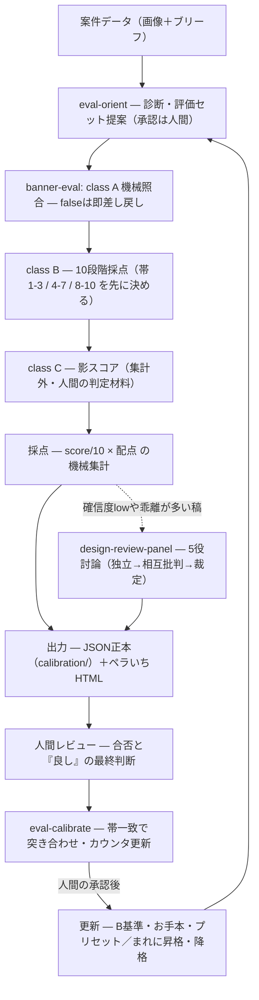

# harness-skills — デザイン評価ハーネスのスキルパック

グラフィック/バナーの評価を AI に任せるための Claude Code スキル群。

> **中心思想:** AIが作ったものを人だけで見るのではなく、「何を良しとするか」「どう検証するか」をSkillsに残す。作るAIだけでなく、評価するAIまで含めて設計する。

## 構成（4スキル＝評価の1周）

| スキル | 役割 | いつ使う |
|---|---|---|
| [eval-orient](skills/eval-orient/SKILL.md) | 診断・評価セット選択 | 評価を始める前に必ず |
| [banner-eval](skills/banner-eval/SKILL.md) | 評価の実行体（A実測照合→B10段階→C影スコア→採点） | 画像＋ブリーフが揃ったら |
| [design-review-panel](skills/design-review-panel/SKILL.md) | 専門家5役の討論（並列サブエージェントで独立評価） | 定性観点を深く見たい時・乖離が大きい時 |
| [eval-calibrate](skills/eval-calibrate/SKILL.md) | 人間FBとの突き合わせ・較正 | 人間のレビュー結果が出るたび |

各スキルの中の流れは図解つきの **[docs/skills-guide.md](docs/skills-guide.md)** を参照。



## 使い方（トリガー例）

| 場面 | 言い方の例 | 起動するスキル |
|---|---|---|
| 案件が来た・評価を始めたい | 「このバナー評価して」（画像＋ブリーフ添付） | eval-orient → banner-eval |
| 定性観点を深く見たい・判定が割れそう | 「討論で見て」 | design-review-panel |
| 人間のレビュー結果が出た | 「このFBと突き合わせて」「較正して」 | eval-calibrate |
| 日本語の組版・文字まわりだけ見たい | 「日本語の組版チェックして」 | zen（外部） |

## 設計原則（このパックの前提）

1. **class A/B/C の三分類。** 機械照合できるもの（A）だけがブロック権限を持つ。程度問題は定性判定（B）で減点。AIが信頼できない観点は人間領域（C）としてAIは観察の列挙まで。**重要度と測定可能性は別の軸** — AIが苦手だから配点を下げる、はやらない（Cに送る）。
2. **点数はAIに発明させない。** AIは観点ごとの3段階判定まで。合計点は配点表からの機械集計。
3. **評価の一次出力はJSON**（calibration/ に蓄積）、人間向けのペラいちHTMLはそこから生成する。較正ループを回すため。
4. **理由型で書く。** 命令型（MUST/NEVER）は捏造率51%、理由型は0%という実証がある。このパックのルールはすべて「なぜ」つき。
5. **評価は較正されて初めて信用できる。** AI評価の精度はガードレール水準（30〜40%）から始まる前提。人間FBとの突き合わせ（eval-calibrate）が本体で、評価スキルはその入力を作る装置。

## インストール

```bash
git clone https://github.com/orimoaides/harness-skills.git
cp -r harness-skills/skills/* ~/.claude/skills/
```

ブランド固有の規定（ロゴレギュレーション・入稿規定・トークン）は含まれていない。各自 `skills/banner-eval/references/brand-profile.md` の雛形に自分のブランドの値を書き込んで使う。

## 併用を推奨する外部スキル

実践者6人（クラシル坪田・PKSHA清水・Rimoにしゃみー・r.kagaya・Findy mukai・kgsi）の2026年発信から、実用系のみ選定（ネタ系は除外）。詳細と出典は [docs/field-notes.md](docs/field-notes.md)。

| スキル | 作者 | 何に効くか | 導入 |
|---|---|---|---|
| [melta-ui: design-review / ban-pattern](https://github.com/tsubotax/melta-ui) | 坪田朋（MIT） | DS違反の重大度別検出＋HTMLレポート／「AIっぽい」を1コマンドで禁止ルール化。クラシル一発動作率20→100%のOSS版 | `git clone` して skills/ を導入 |
| [Parascope-skills: /zen](https://github.com/lumilinks-hq/Parascope-skills) | kgsi | **日本語デザイン品質**（和文の行間・行長・組版）。日本語バナー評価と相性最良 | `npx skills add lumilinks-hq/Parascope-skills` |
| [skill-evaluator](https://ai-data-base.com/skill/skill-evaluator/) | AIDB | スキル自体を13項目39点で採点。本パックの4スキルの健診に | zip配置 |
| [Impeccable](https://impeccable.style) | — | 29アンチパターン検出（生成側の品質） | 公式手順 |
| [ui-skills](https://ui-skills.com) / [Taste Skill](https://github.com/Leonxlnx/taste-skill) | ibelick / Leonxlnx | 生成側の凡庸回避 | 公式手順 |

**入れすぎ注意**: 2026年の効果検証研究では8割のスキルが性能を動かさず、過剰導入は逆効果。まず melta-ui と /zen だけ入れて評価ループを回し、必要が実証されたら足すこと。

非公開だが設計参考: PKSHAのスキル評価用スキル（8観点）・ヒューリスティック評価スキル、Rimoの制約セット、r.kagayaのharness-entropy/feedback（いずれも field-notes 参照）。

## 思想・方針ドキュメント（docs/）

スキルの背後にある考え方も一式同梱。会社環境などへ持ち込むときはリポジトリごとcloneすれば全部ついてくる。

| ドキュメント | 中身 |
|---|---|
| [philosophy.md](docs/philosophy.md) | 中心思想・4層定義・class A/B/C設計・メタスキルループ・較正ルールの原本 |
| [design-rationale.md](docs/design-rationale.md) | 個々の設計判断の「なぜ」（帯が先の理由・影スコアの理由 等） |
| [skills-guide.md](docs/skills-guide.md) | 各スキルの説明図解（mermaid）とクラス早見表 |
| [field-notes.md](docs/field-notes.md) | 実践者6人から抽出した知見と出典 |
| [intake-ledger.md](docs/intake-ledger.md) | 参考リンクの取り込み台帳（スキル化/知見の判定と出典つき） |
| [skill-plan-2026-07.md](docs/skill-plan-2026-07.md) | スキル化計画の初期整理（経緯の記録） |

## 参考元

- kgsi: [デザインハーネスとは何か](https://note.com/kgsi/n/n707d989e1a44) / [現在地とこれから](https://note.com/kgsi/n/n64123e4e2aa6)（収束と探索）
- PKSHA 清水はるか: [ヒューリスティック評価のスキル化](https://zenn.dev/pksha/articles/8f4d45b913ed50)（未確認テーブル・ループバック）
- classmethod: [MUST vs 理由の実証](https://dev.classmethod.jp/articles/claude-skill-must-vs-reason/)
- Anthropic: [How we use skills](https://claude.com/blog/lessons-from-building-claude-code-how-we-use-skills)（9分類・Gotchas・検証スキルの価値）
- Jamie Mill: [Layers](https://parascope.design/resources/layers)（orient-first設計）
