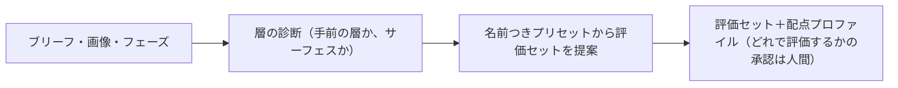
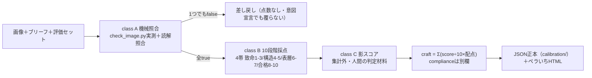
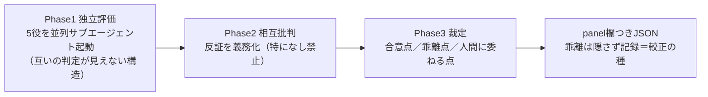
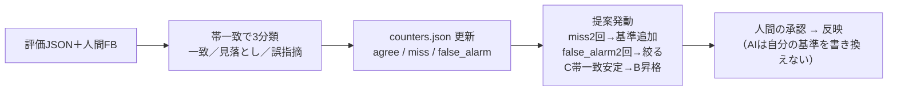

# skills-guide — 各スキルの説明図解

4スキルの役割・起動条件・中の流れ。システム全体の流れは [README](../README.md) の全体図を参照。

---

## ① eval-orient — 診断・評価セット選択

**起動:** 評価依頼の最初に必ず。`/eval-orient [ブリーフ] [画像]` または「このバナー評価して」で自動起動。

覚えておくこと: orientは見立てまで。問題の指摘を始めると banner-eval と二重評価になり較正が壊れる。プリセットは [presets.md](../skills/eval-orient/references/presets.md)（初稿=探索モードは点数なし）。

---

## ② banner-eval — 評価の実行体

**起動:** `/banner-eval [画像] [ブリーフ]` または「採点して」「チェックして」＋画像。

覚えておくこと: 寸法・比率・容量・形式はスクリプトで実測（Pillow必須）。ブリーフが無い項目は推測せずunverified。このスキルは直さない（改善指示まで）。

---

## ③ design-review-panel — 5役討論

**起動:** 確信度lowが多い・割れそうな稿・「討論で見て」。毎回ではない。

5役: 組版タイポ／ブランド監査／アクセシビリティ／視覚階層・構図／訴求・ブリーフ適合。class Aは対象外（機械照合に議論は不要）。

---

## ④ eval-calibrate — 較正（ハーネスが育つ場所）

**起動:** 人間のレビュー結果が出たら。「突き合わせて」「較正して」。

覚えておくこと: ±1点のズレは追わない（帯で見る）。カウンタはリセットせず `since` 更新で再カウント。

---

## クラスの早見表

| class | 判定 | 効力 | 主な観点 |
|---|---|---|---|
| **A** | true/false（スクリプト実測＋読解照合） | 1つでもfalseでブロック。意図宣言でも覆らない | 必須要素・文字の正確性・NG/序列・禁則・サイズ/比率/容量・ロゴ規定 |
| **B** | 10段階・4帯（致命1-3/構造4-5/表層6-7/合格8-10）→帯内1点刻み | 配点対象。意図宣言の不問化は依頼主/レビュアー承認が条件・1稿3件以上で警告 | ブリーフ適合・ブランド・視覚階層・レイアウト・配色・素材・技術品質 |
| **C** | 影スコア（10段階・集計外） | 人間の判定材料＋較正データ。帯一致が安定したらB昇格 | カーニング・らしさ・質感 |
