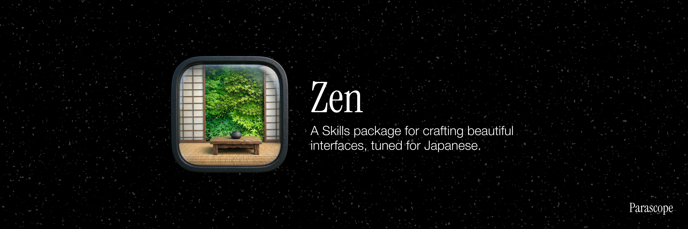

<p align="center">
  
</p>

# Zen

AI コーディングエージェントが生成する日本語サイト・アプリに、日本語固有のデザインルールを適用するスキル。英語圏のデフォルトをそのまま日本語に当てると破綻する問題を、明文化された判定基準で防ぎます。

## Install

`/zen` を含む Parascope Skills 一式をインストール:

```bash
npx skills add lumilinks-hq/Parascope-skills
```

## Features

- **日本語固有の判定ルール** — 英語圏では正解ですが日本語では破綻する定石を、Reject / Warn 条件として明示しています（R1–R6 / W1–W6）
- **再現可能なスコアリング** — 判定基準を明文化し、評価者ごとのブレを最小化します（例: 「4 ウェイト以上」はファミリー横断合算、Critical 減点は複数該当でも -2 一度きり）
- **3 モードで責務分離** — 字組（typeset）/ 言語（clarify）/ 統合（critique）の 3 モードで観点を分けています。依頼内容から自動でルーティングされ、critique では 3 スコアの平均で総合判定します
- **プロファイル別推奨値** — media / saas / docs / dashboard で値が変わります。LP と業務 UI に同じ行間を強要しません
- **AI エージェント向け設計** — Progressive disclosure 構造（薄い SKILL.md + 必要時に Read される references/*.md）で、Claude Code の subagent が必要な観点だけを読み込めます

## Usage

`/zen` はひとつのスキルで、内部に 3 つのモードを持ちます。依頼内容に応じて自動ルーティングされ、`--mode` で明示指定もできます。

```
/zen                              # 自動ルーティング（迷ったら critique）
/zen src/app/page.tsx              # 対象ファイル指定
/zen --mode typeset src/app/page.tsx
/zen --mode clarify src/components/login-form.tsx
/zen --mode critique src/app/page.tsx
```

### typeset モード — タイポグラフィ

日本語Webタイポグラフィを評価し、具体的な改善を提案する。「フォントが」「行間が」「読みにくい」といった依頼で選ばれます。

**カバーする領域:**
- 行長 — `em` 基準（`ch` は日本語に不適）、長文コンテンツのみ制限
- 行間 — `line-height: 1.8`（日本語は英語より広く取る）
- フォント選定 — 日本語Webフォント、游ゴシック問題、和欧混植
- モジュラースケール — 比率に基づく文字サイズ体系
- Vertical Rhythm — 行送りの倍数で余白を統制
- 約物 — `palt` / `halt` / `chws` の使い分け
- ウェイト — 日本語フォントは画数が多く、500 で十分な太さがある
- 禁則処理 — `line-break: strict`
- プロファイル別推奨値 — media / saas / docs / dashboard で最適値が違う
- Reject / Warn 条件 — `break-all` 全体適用、本文の過剰な `letter-spacing` 等は即差し戻し
- 責務分離 — 本文 / 見出し / 表 / フォームのルールを分けて評価
- CSSレシピ — 修正提案時に使える再利用可能なCSS断片

**設計思想:**

タイポグラフィを音楽に例える — ハーモニー（文字サイズの比率）、リズム（余白の規則性）、メロディ（コンテンツそのもの）。恣意的な値の集合ではなく、数学的な法則に従った体系として設計する。

### clarify モード — UXコピー

日本語UIコピー・マイクロコピーを評価し、具体的な改善を提案する。「ボタンのラベルが」「エラーメッセージを」「敬語が揺れてる」といった依頼で選ばれます。

**カバーする領域:**
- 敬語レベルの一貫性 — 一画面内でトーンが揺れていないか
- ボタンラベル — 活用形式（体言止め / 辞書形 / ます形）の統一
- エラーメッセージ — 「原因 + 対処法」構造、温度感の調整
- カタカナ語の密度 — 和語で通じるなら和語
- 主語・目的語の明示 — 「削除しました」→ 何が？
- 空状態 — 導線とCTAの提供

### critique モード — 統合批評

タイポグラフィ + UXコピー + サイト全体の設計品質を横断的に批評する。「全体を見て」「リリース前チェック」「総合的に」といった依頼や、対象が特定領域に絞れない場合に選ばれます。

**独自の評価観点:**
- 情報密度と余白 — 日本語の視覚密度に余白が合っているか
- 和洋バランス — 英語ナビ × 日本語コンテンツのちぐはぐさ
- フォーム設計 — 氏名順序、郵便番号補完、入力モード
- レスポンシブ — 見出しの不自然な改行、ボタンの折り返し
- ダークモード — 日本語フォントの可読性補正
- アクセシビリティ — `lang="ja"`、コントラスト比
- 壊れやすい場所チェック — 本文と見出しの混同、`break-all` 乱用、表/フォーム分離、mixed-script 崩れ

## Why "Zen"

禅 — 引き算の美学、意図的な余白、静けさの中の力。日本語デザインが持つべき品質そのもの。

## License

Apache 2.0
